# whack02-RadarSideQuest

### WHACK02-Radar, but every flight is re-planted next to the radar

*S-band · fan-beam · Swerling-1 · derived link budget · a dense in-coverage stress test*

A variant of [WHACK02-Radar](https://github.com/zheniannn/WHACK02-Radar) whose **only** difference is one step folded into stage 5: it **rigidly translates every one of the ~82k WHACK01 trajectories** so its origin lands at a uniformly random point within **10 km** of the radar, preserving each flight's exact motion (speeds, turns, shape). Everything else — the S-band radar, the physics, stages 6–9 and the scene figures — is identical. The result is a **dense in-coverage scenario** where every flight originates near the site and fans outward.

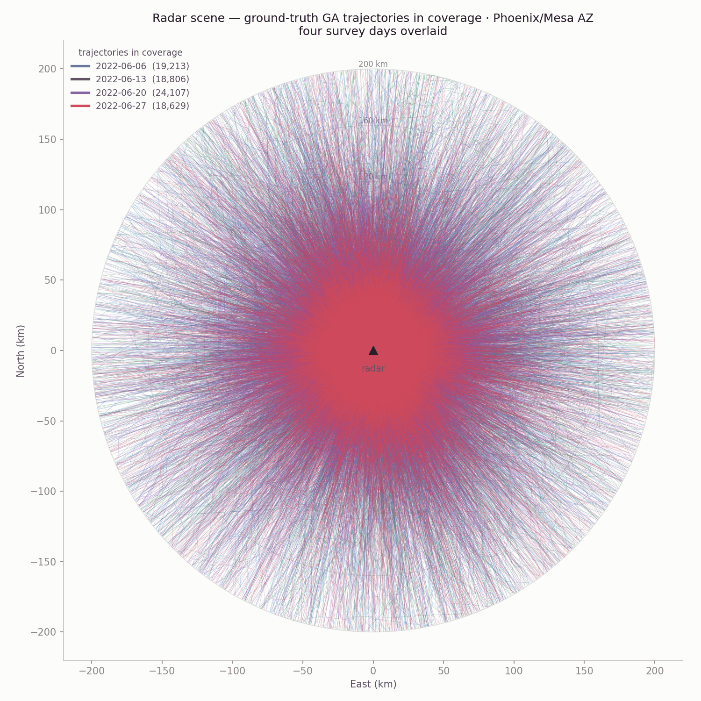

> **At a glance**
> - WHACK02 has only ~1,250 trajectories/day *in coverage* (most GA flies outside 200 km of Phoenix). Relocation pulls **all ~19k/day into coverage** — a target field ~15× denser (**1.7 M target detections/day** vs ~100k).
> - Identical radar: **15.0 dB operating anchor** from the S-band link budget, **74.8 km** deterministic horizon.
> - Denser field, harder tracking: detection limit **70.7 km** (≈ WHACK02's 70.5), but tracking limit **36.8 km** (vs 43.1) — more crossing tracks break sooner.

## What's different from WHACK02-Radar

Almost nothing — by design. Stages 6–9, the scene-figures script, and the entire `utils/` radar layer are **byte-identical** to WHACK02. The variant is exactly two things:

| Piece | Role |
|---|---|
| the relocation step in `scripts/05_radar_scenario.py` (via `utils/relocate.py`) | **The one difference** — after freezing the scenario, stage 5 rigidly translates every trajectory so its first point is uniformly within 10 km of the radar; motion is translation-invariant, so speeds/turns/shape are preserved exactly |
| `utils/io.py` | Outputs isolated under `active/sidequest/` and `plot/whack02-RadarSideQuest/` so nothing collides with WHACK02 |

Stage 5 selects the site and builds the real-flight detection figures from the **original** trajectories (into a separate `beam_crossings_source` cache); the relocated set it writes is what stages 6–9 consume.

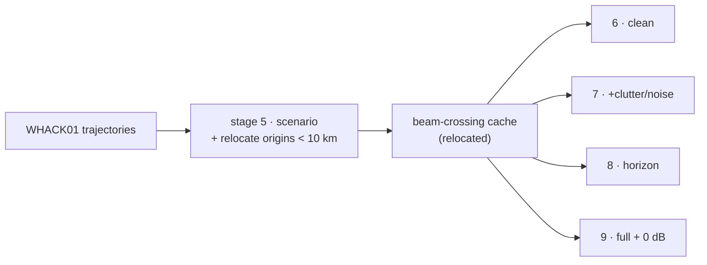

## Quickstart

Python ≥ 3.9 with `numpy`, `pandas`, `matplotlib`:

```bash
pip install -r requirements.txt
```

Data root defaults to `data/` beside the repo (override with `WHACK_DATA_ROOT`); WHACK01's `active/trajectories_10s/` must be present. Then (identical to WHACK02, minus the relocation that stage 5 now does):

```bash
python scripts/05_radar_scenario.py          # site + link budget + RELOCATE origins + real-flight figures
python scripts/06_trajectories_clean.py
python scripts/07_trajectories_cluttered.py
python scripts/08_trajectories_radar_equation.py
python scripts/09_radar_equation_cluttered.py
python scripts/radar_scene_days.py        # optional: scene figures
```

Every stage ends with a validation gate (Pd vs the Swerling-1 closed form, false-alarm rate within 5σ) that raises on failure.

## The radar (unchanged from WHACK02)

A 2D fan-beam **S-band** surveillance radar (2.8 GHz, 10 s scan, 1–200 km, 150 m × 1.5° cells). The 15 dB operating anchor is **derived from an explicit link budget**: single-pulse SNR from `Pt·G²·λ²·σ / ((4π)³·R⁴·kT₀BF·L)` (15 kW, 34 dBi, B = 1 MHz, NF = 4 dB, solved loss ≈ 9.3 dB) → ~0 dB at 50 km, lifted ≈ 15 dB by coherent integration of ~31 pulses/dwell. Detection is Swerling-1: `Pfa = e^(−τ)`, `Pd = Pfa^(1/(1+SNR))`.

The real-flight detection figures (N118AT, outbound 8 → 200 km) illustrate the range physics — relocation-independent, so built from the source flight. Dropping the CFAR floor from 8 dB to 0 dB keeps the fading echo detectable much farther out, but floods the scope with noise crossings (≈9 → ≈1,840 of 5,000 cells):

<table><tr>
<td width="50%" align="center"><b>8 dB CFAR floor</b><br>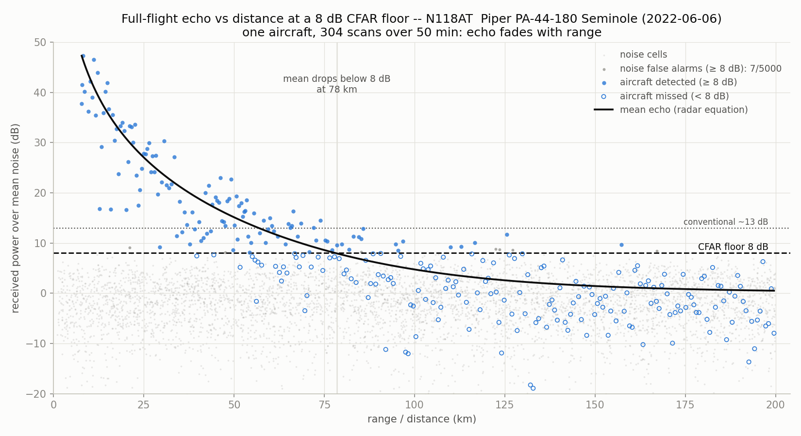</td>
<td width="50%" align="center"><b>0 dB CFAR floor</b><br></td>
</tr></table>

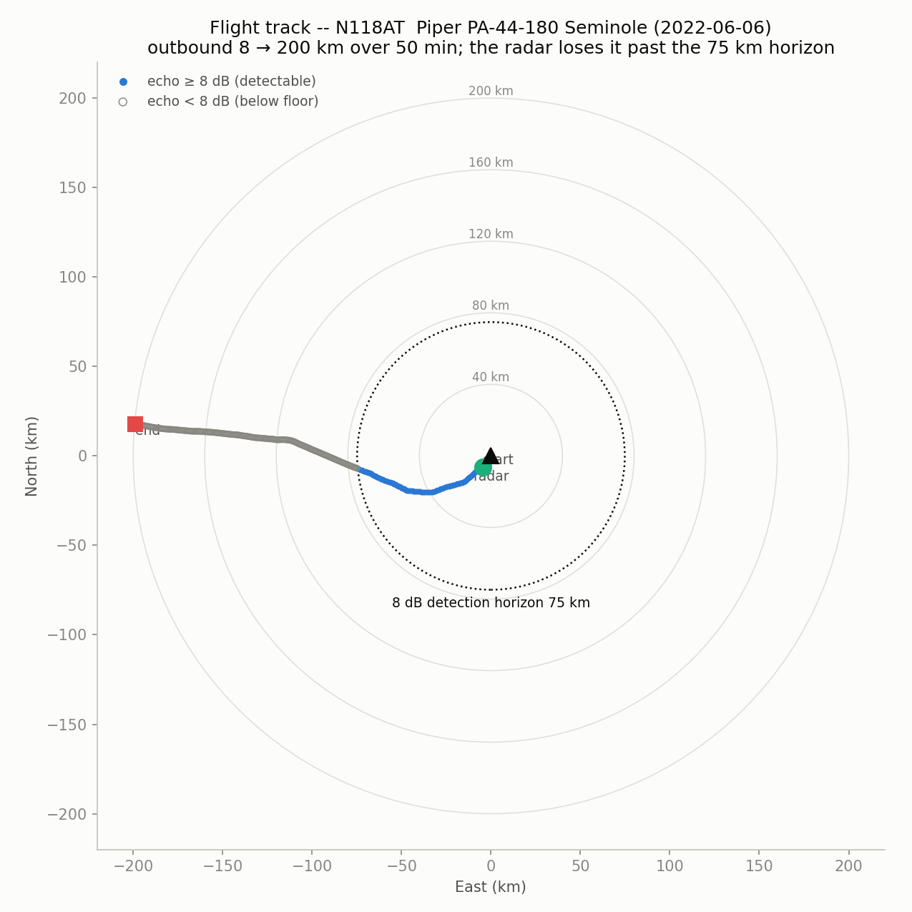

## The ladder, in figures (on the relocated set)

**Stage 6 — trajectories alone**, fixed 15 dB, nothing stochastic — the dense relocated field, clean:

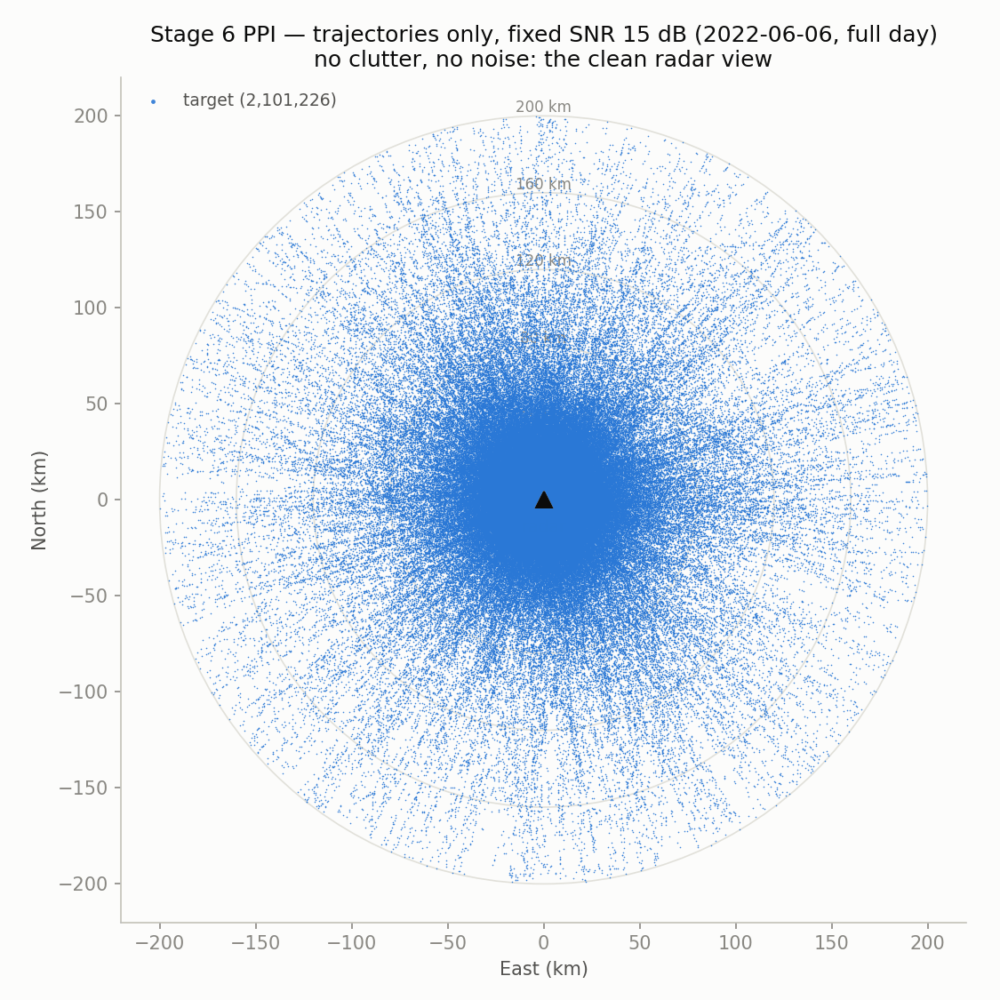

**Stage 7 — add contamination** (Swerling fluctuation, measurement noise, ~579 false alarms/scan over 318,240 cells, 25 clutter patches):

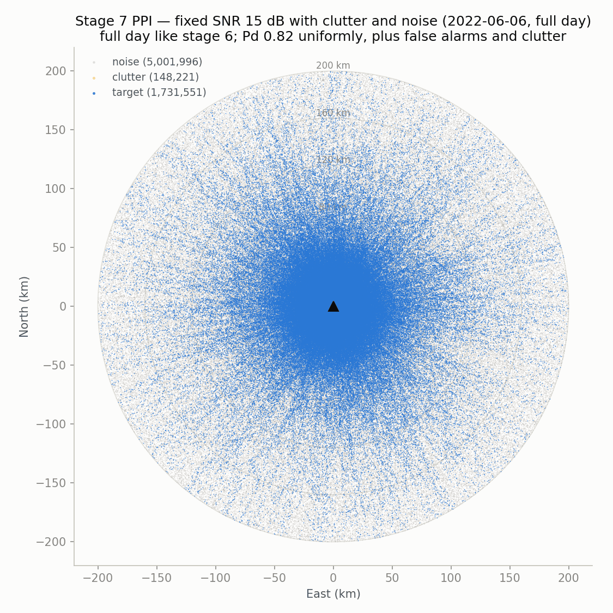

**Stage 8 — the range limit alone** (radar-equation SNR, deterministic): the hard **74.8 km** horizon. Aircraft fan out to 200 km; the radar only detects inside the ring:

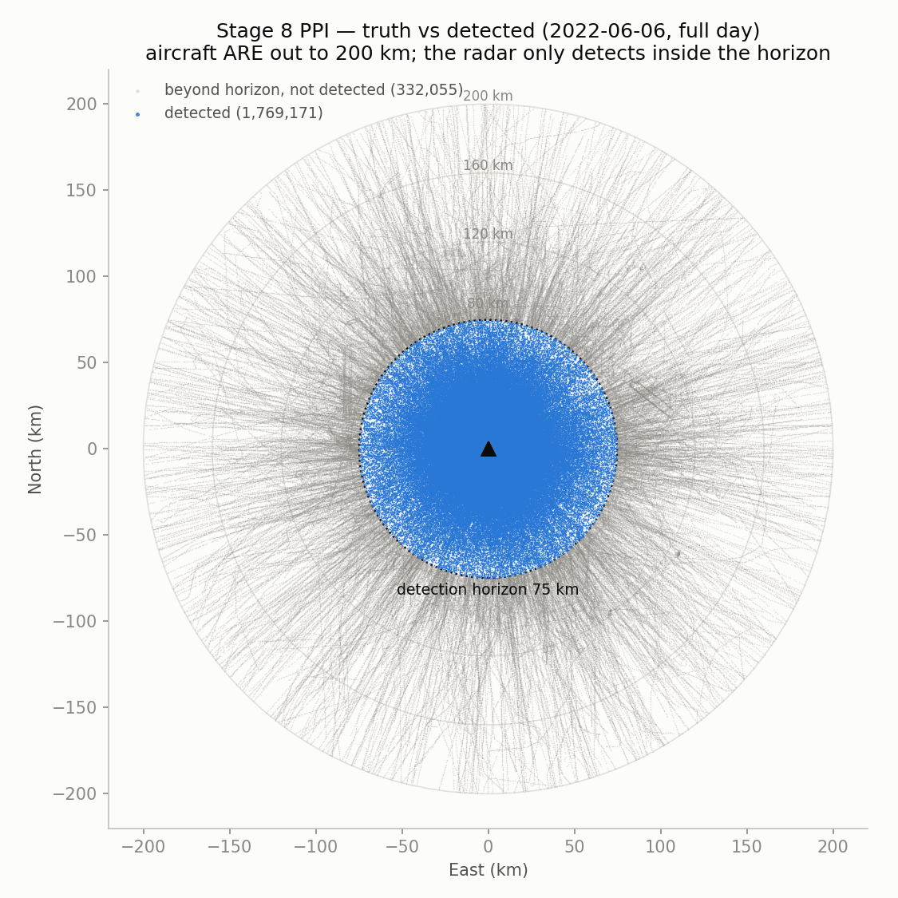

**Stage 9 — full physics.** 1.7 M target detections form a dense disk fading with range, buried in the noise field:

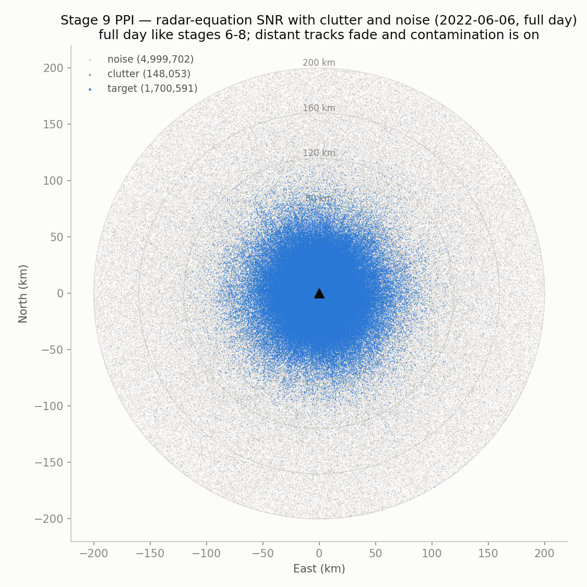

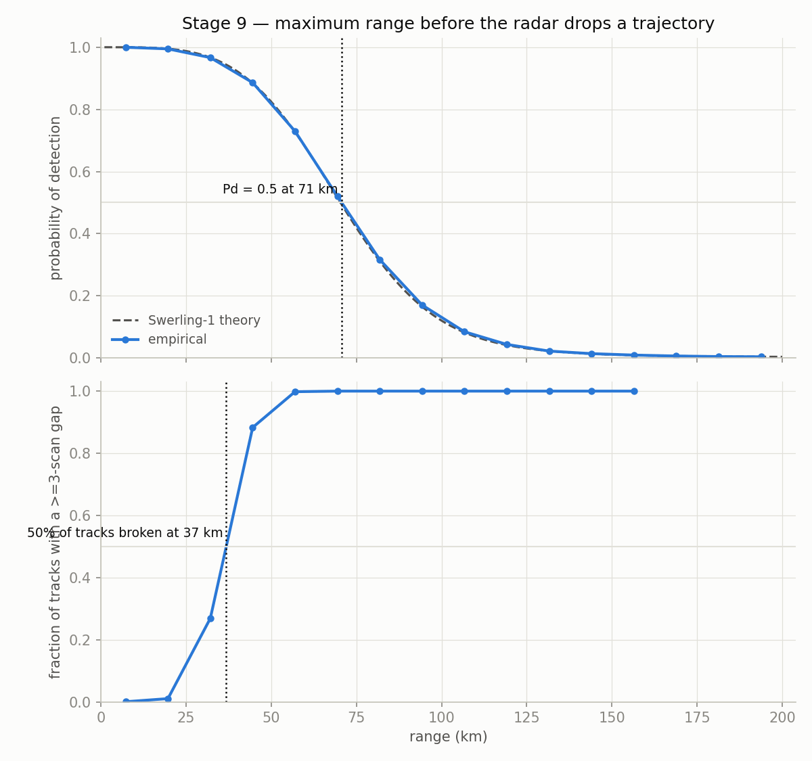

- **Detection limit 70.7 km** (single-scan Pd = 0.5; closed form 70.3 km)
- **Tracking limit 36.8 km** (50 % of tracks broken by a ≥ 3-scan gap)

Detection matches WHACK02 (same radar), but the tracking limit is **lower** (36.8 vs 43.1 km): with ~15× more targets crossing at all ranges, more tracks pick up a fatal miss gap sooner. The RTI shows targets sloping with range rate through the clutter/noise:

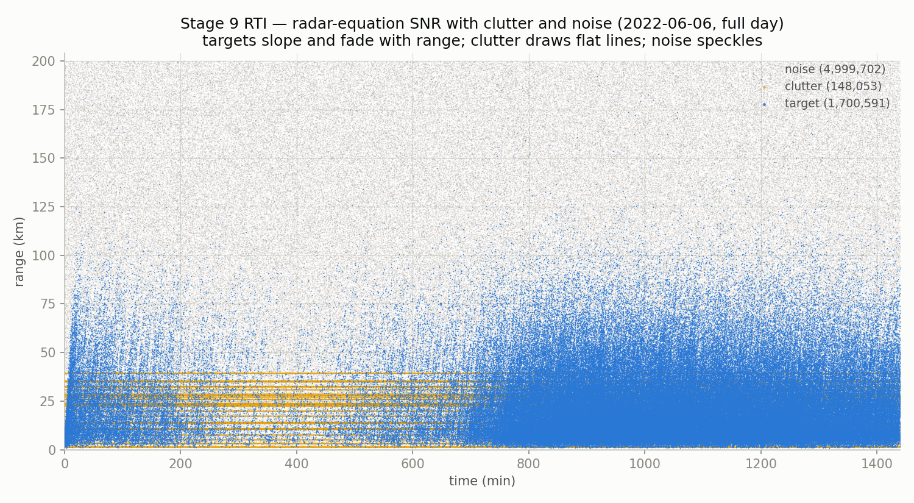

**The 0 dB experiment.** Drop the CFAR floor to 0 dB: horizon jumps to 118.6 km (detection limit 146 km, tracking 56 km) — but at ~117,000 false alarms/scan, single-scan detection is hopeless. The motivation for track-based discrimination:

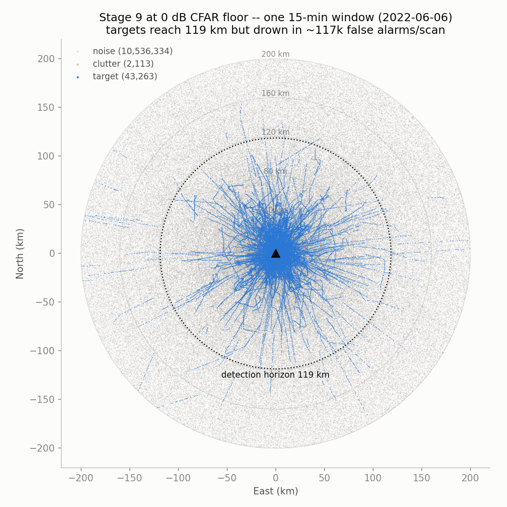

## Repository layout

```
scripts/                             # everything but 05 is byte-identical to WHACK02
├── 05_radar_scenario.py             # site + link budget + RELOCATE origins + real-flight figures
├── 06..09_*.py                      # the ladder (identical to WHACK02, on the relocated set)
└── radar_scene_days.py              # scene figures per day (identical to WHACK02, auxiliary)
utils/
├── io.py                # paths, isolated under active/sidequest & plot/whack02-RadarSideQuest
├── relocate.py          # the rigid ENU relocation (the one addition)
├── scenario.py · geometry.py · beam_crossings.py · measurements.py · plots.py   # identical to WHACK02
docs/figures/            # README images
```

## Data layout

```
<data root>/active/
├── trajectories_10s/                 # WHACK01 stage 4 output (read-only source)
└── sidequest/
    ├── trajectories_10s/             # stage 5 relocated set (stages 6-9 input)
    └── radar/
        ├── scenario.json
        ├── beam_crossings/           # relocated-set cache (stages 6-9)
        ├── beam_crossings_source/    # source-flight cache (stage 5 figures only)
        └── stage06..09/
```
